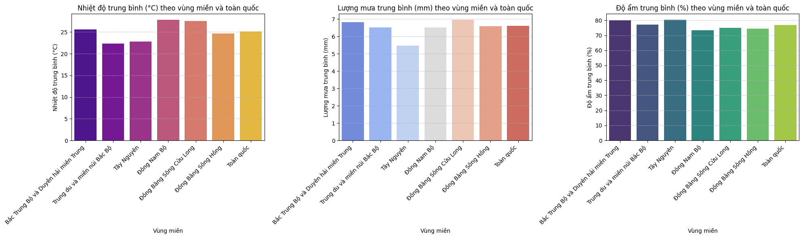
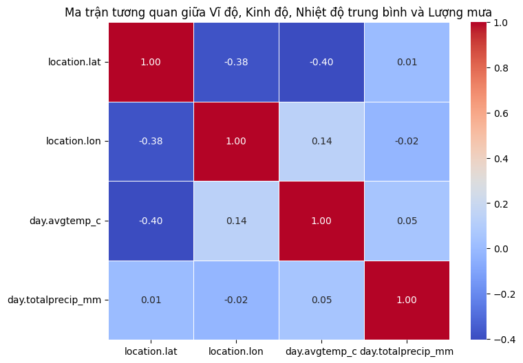
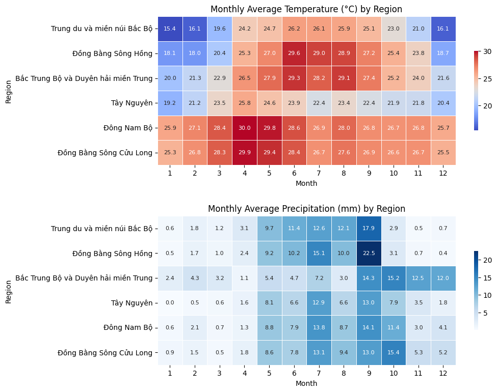
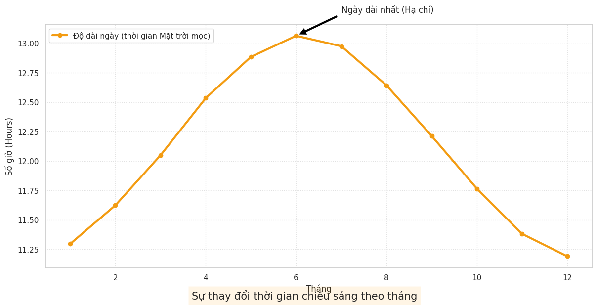
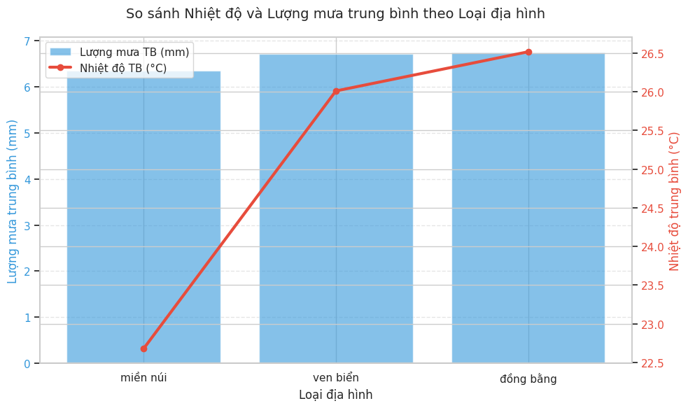
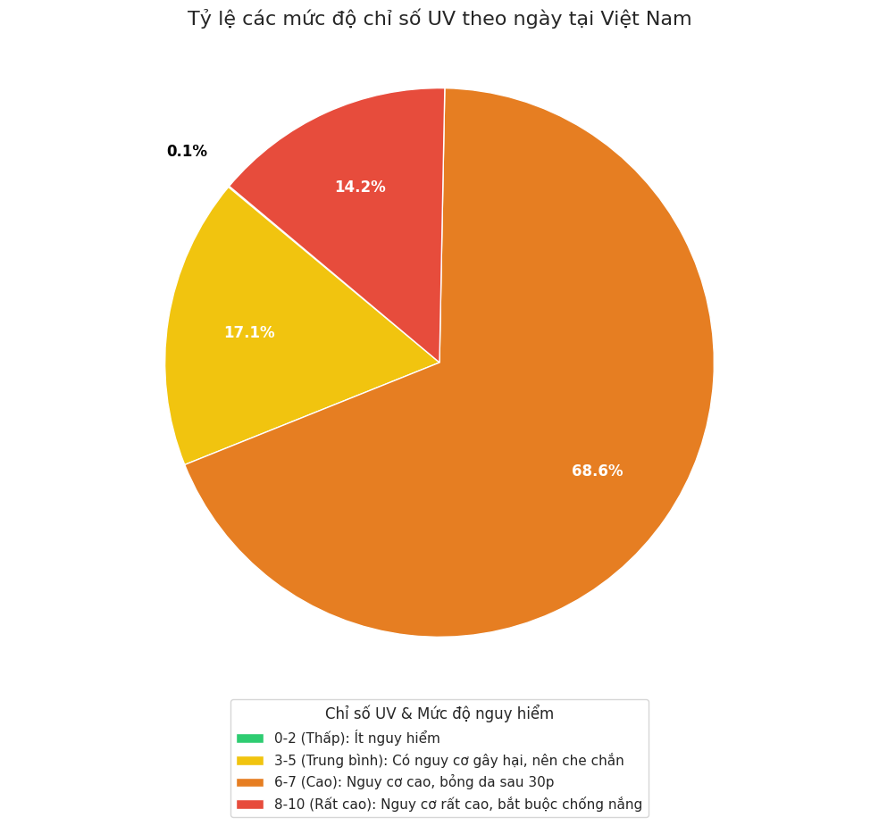
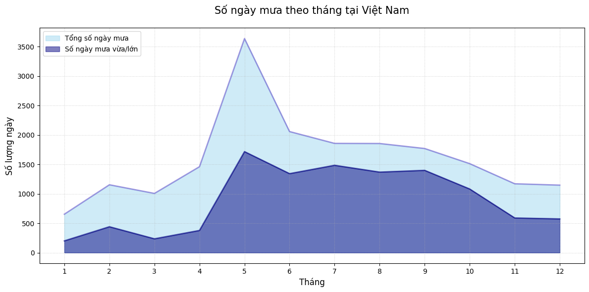
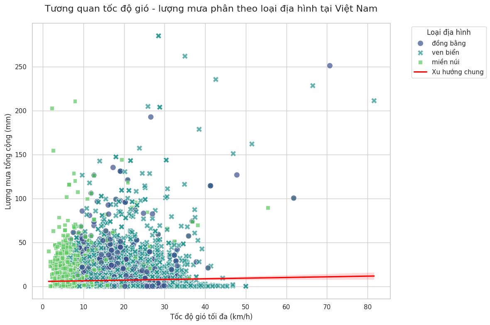
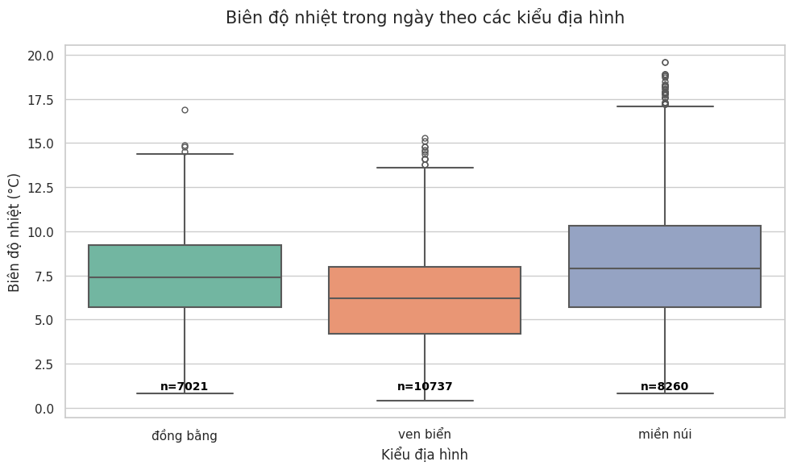

## 1. Mục tiêu

Notebook tập trung trả lời ba câu hỏi chính:

- Thời tiết Việt Nam nhìn chung có đặc điểm gì?
- Thời tiết phân hóa theo **vùng**, **thời gian** và **địa hình** ra sao?
- Mức độ **cực đoan** của thời tiết thể hiện qua UV, mưa, gió và biên độ nhiệt như thế nào?

## 2. Dữ liệu sử dụng

Ý nghĩa các cột trong dataset

| Tên Cột                  | Kiểu dữ liệu | Mô tả                                                               |
| :----------------------- | :----------- | :------------------------------------------------------------------ |
| `location.name`          | `object`     | Tên địa điểm (tỉnh/thành phố).                                     |
| `location.region`        | `object`     | Vùng miền của địa điểm.                                            |
| `location.terrain`       | `object`     | Loại địa hình của địa điểm (ví dụ: đồng bằng, miền núi, ven biển).  |
| `location.country`       | `object`     | Quốc gia của địa điểm (trong trường hợp này là Việt Nam).           |
| `location.lat`           | `float64`    | Vĩ độ của địa điểm.                                                |
| `location.lon`           | `float64`    | Kinh độ của địa điểm.                                              |
| `date`                   | `datetime64` | Ngày dự báo thời tiết.                                             |
| `date_epoch`             | `int64`      | Thời gian dưới dạng Epoch (số giây kể từ 01/01/1970 UTC).           |
| `day.maxtemp_c`          | `float64`    | Nhiệt độ tối đa trong ngày (°C).                                   |
| `day.maxtemp_f`          | `float64`    | Nhiệt độ tối đa trong ngày (°F).                                   |
| `day.mintemp_c`          | `float64`    | Nhiệt độ tối thiểu trong ngày (°C).                                |
| `day.mintemp_f`          | `float64`    | Nhiệt độ tối thiểu trong ngày (°F).                                |
| `day.avgtemp_c`          | `float64`    | Nhiệt độ trung bình trong ngày (°C).                               |
| `day.avgtemp_f`          | `float64`    | Nhiệt độ trung bình trong ngày (°F).                               |
| `day.maxwind_mph`        | `float64`    | Tốc độ gió tối đa trong ngày (dặm/giờ).                            |
| `day.maxwind_kph`        | `float64`    | Tốc độ gió tối đa trong ngày (km/giờ).                             |
| `day.totalprecip_mm`     | `float64`    | Tổng lượng mưa trong ngày (mm).                                    |
| `day.totalprecip_in`     | `float64`    | Tổng lượng mưa trong ngày (inch).                                  |
| `day.totalsnow_cm`       | `float64`    | Tổng lượng tuyết rơi trong ngày (cm).                               |
| `day.avgvis_km`          | `float64`    | Tầm nhìn trung bình trong ngày (km).                               |
| `day.avgvis_miles`       | `float64`    | Tầm nhìn trung bình trong ngày (dặm).                              |
| `day.avghumidity`        | `int64`      | Độ ẩm trung bình trong ngày (%).                                   |
| `day.daily_will_it_rain` | `int64`      | Có mưa trong ngày hay không (1 = Có, 0 = Không).                    |
| `day.daily_chance_of_rain` | `int64`    | Khả năng mưa trong ngày (%).                                       |
| `day.condition.text`     | `object`     | Mô tả điều kiện thời tiết (ví dụ: "Sunny", "Partly cloudy").       |
| `day.condition.icon`     | `object`     | Liên kết đến biểu tượng điều kiện thời tiết.                       |
| `day.condition.code`     | `int64`      | Mã số điều kiện thời tiết.                                         |
| `day.uv`                 | `float64`    | Chỉ số tia UV.                                                     |
| `astro.sunrise`          | `object`     | Thời gian mặt trời mọc.                                            |
| `astro.sunset`           | `object`     | Thời gian mặt trời lặn.                                            |
| `astro.moonrise`         | `object`     | Thời gian trăng mọc.                                               |
| `astro.moonset`          | `object`     | Thời gian trăng lặn.                                               |
| `astro.moon_phase`       | `object`     | Giai đoạn mặt trăng.                                              |
| `astro.moon_illumination` | `int64`     | Độ sáng của mặt trăng (%).                                         |

Các cột này cung cấp một cái nhìn toàn diện về điều kiện thời tiết tại các địa điểm khác nhau ở Việt Nam, bao gồm thông tin về nhiệt độ, độ ẩm, gió, lượng mưa, tầm nhìn và các yếu tố thiên văn khác.

## 3. Tiền xử lý 

```python
import pandas as pd
import numpy as np

# Đọc dữ liệu
# df_weather = pd.read_csv("df_weather.csv")

# Chuẩn hóa tên vùng bị lỗi ký tự
df_weather['location.region'] = df_weather['location.region'].replace(
    'Tr [*]ung du và miền núi Bắc Bộ',
    'Trung du và miền núi Bắc Bộ'
)

# Chuyển cột ngày sang datetime và tạo cột tháng
df_weather['date'] = pd.to_datetime(df_weather['date'])
df_weather['month'] = df_weather['date'].dt.month
```

## 4. Tổng quan khí hậu theo vùng

```python
regional_averages = (
    df_weather.groupby('location.region')[['day.avgtemp_c', 'day.totalprecip_mm', 'day.avghumidity']]
    .mean()
    .reset_index()
)
```



### Nhận xét ngắn

Nhìn tổng thể, các vùng của Việt Nam đều mang đặc trưng **nóng ẩm, mưa nhiều** của khí hậu nhiệt đới. Nhiệt độ trung bình ở các vùng đều trên 20°C, độ ẩm cao và lượng mưa trung bình ngày khá lớn (trên 5mm (tức hơn 1500mm/năm), độ ẩm > 70%.). Sự khác biệt giữa các vùng có tồn tại, nhưng chưa quá lớn nếu chỉ nhìn ở mức trung bình năm.

## 5. Phân hóa theo vị trí địa lý

```python
selected_columns = ['location.lat', 'location.lon', 'day.avgtemp_c', 'day.totalprecip_mm']
correlation_matrix = df_weather[selected_columns].dropna().corr()
```



### Nhận xét ngắn

Có thể thấy tọa độ địa lý **tương quan yếu** với chỉ số thời tiết, tức tính chất thời tiết khá đồng nhất, không khác biệt nhiều giữa các miền. Điểm rõ nhất là mối tương quan âm giữa **vĩ độ** và **nhiệt độ trung bình**: càng ra xa xích đạo, nhiệt độ có xu hướng giảm. Điều này cho thấy khác biệt Bắc - Nam là có, nhưng không đủ để giải thích toàn bộ tính chất thời tiết chỉ bằng tọa độ.

Song khi xét theo thời gian, giữa các miền địa lý lại có những sự khác biệt rõ rệt về biểu hiện thời tiết. Biểu đồ dưới đây cho thấy biến động nhiệt độ và lượng mưa trong năm theo từng miền:

## 6. Phân hóa theo thời gian và vùng miền

```python
monthly_weather_summary = (
    df_weather.groupby(['location.region', 'month'])[['day.avgtemp_c', 'day.totalprecip_mm']]
    .mean()
    .reset_index()
)
```



### Nhận xét:

#### Phân tích biểu đồ Nhiệt độ trung bình hàng tháng theo vùng miền:

*   **Xu hướng chung**: Hầu hết các vùng miền đều có nhiệt độ cao, nhất vào các tháng giữa năm (tháng 4 - tháng 8) và thấp nhất vào các tháng đầu và cuối năm (tháng 12 - tháng 2), phản ánh rõ rệt chu kỳ mùa.
*   **Đồng Bằng Sông Cửu Long và Đông Nam Bộ**: Duy trì nhiệt độ cao ổn định quanh năm, ít biến động theo mùa so với các vùng khác, với nhiệt độ trung bình thường trên 25°C. Nhiệt độ đạt đỉnh vào khoảng tháng 4-5.
*   **Bắc Trung Bộ và Duyên hải miền Trung**: Có sự biến động nhiệt độ rõ rệt giữa các mùa. Nhiệt độ thấp nhất vào mùa đông và tăng dần đến mùa hè, với đỉnh điểm vào tháng 6-7.
*   **Trung du và miền núi Bắc Bộ, Đồng Bằng Sông Hồng**: Nhiệt độ có sự chênh lệch lớn nhất giữa mùa đông và mùa hè. Mùa đông (tháng 12 - tháng 2) khá lạnh, đặc biệt ở Trung du và miền núi Bắc Bộ, trong khi mùa hè (tháng 6 - tháng 8) nhiệt độ tăng cao. Trung du và miền núi Bắc Bộ thường có nhiệt độ thấp nhất cả nước vào mùa đông.
*   **Tây Nguyên**: Nhiệt độ ôn hòa hơn so với các vùng khác, ít biến động mạnh, nhưng vẫn có xu hướng tăng vào mùa khô và giảm nhẹ vào mùa mưa.

#### Phân tích biểu đồ Lượng mưa trung bình hàng tháng theo vùng miền:

*   **Xu hướng chung**: Hầu hết các vùng miền đều có mùa mưa rõ rệt, tập trung vào các tháng giữa và cuối năm (tháng 5 - tháng 10), và mùa khô vào các tháng đầu năm.
*   **Đồng Bằng Sông Cửu Long và Đông Nam Bộ**: Có mùa mưa kéo dài, với lượng mưa cao nhất vào khoảng tháng 9-10. Mùa khô kéo dài từ tháng 12 đến tháng 4.
*   **Bắc Trung Bộ và Duyên hải miền Trung**: Lượng mưa phân bố không đều. Vùng này thường chịu ảnh hưởng của bão và áp thấp nhiệt đới, gây mưa lớn vào các tháng cuối năm (tháng 9 - tháng 11), đôi khi có những đợt mưa trái mùa.
*   **Trung du và miền núi Bắc Bộ, Đồng Bằng Sông Hồng**: Mưa lớn tập trung vào mùa hè (tháng 6 - tháng 9), đặc biệt là vào tháng 7-8. Đây cũng là mùa bão và lũ lụt ở miền Bắc.
*   **Tây Nguyên**: Có mùa mưa rõ rệt từ tháng 5 đến tháng 10, với lượng mưa đạt đỉnh vào khoảng tháng 8-9. Mùa khô rất rõ ràng với lượng mưa thấp kỷ lục từ tháng 12 đến tháng 4.

#### Kết luận
*   Trong khi các miền địa lý phía Bắc có 2 nền nhiệt khác biệt rõ rệt trong năm: nóng vào hè - thu, lạnh vào xuân và đông thì phía Nam nóng đều quanh năm, nhiệt độ không có sự chênh lệch lớn.
*   Thời điểm nóng nhất trong năm ở phía Nam trùng vào cuối mùa khô, còn thời điểm nóng nhất trong năm ở phía Bắc trùng vào mùa mưa. Điều đó tạo nên 2 kiểu khí hậu khá điển hình: trong Nam là khí hậu cận xích đạo gồm mùa mưa và mùa khô, phía Bắc là khí hậu gió mùa gồm mùa đông lạnh khô và mùa hè nóng ẩm.

## 7. Phân hóa theo thời gian chiếu sáng

```python
def time_to_hours(time_str):
    t = pd.to_datetime(time_str, format='%I:%M %p')
    return t.hour + t.minute / 60

df = df_weather.copy()
df['day_length'] = df['astro.sunset'].apply(time_to_hours) - df['astro.sunrise'].apply(time_to_hours)
monthly_astro = df.groupby('month')['day_length'].mean()
```



### Nhận xét ngắn

Độ dài ngày tăng dần từ đầu năm và đạt đỉnh vào khoảng tháng 6 (Hạ chí) rồi giảm dần về những tháng cuối năm. Đây là biểu hiện rõ rệt của một quốc gia ở bán cầu Bắc như Việt Nam, đồng thời phản ánh một tính chất thời gian rất đặc trưng: "Đêm tháng Năm chưa nằm đã sáng, ngày tháng Mười chưa cười đã tối".

## 8. Phân hóa theo địa hình

```python
terrain_stats = (
    df_weather.groupby('location.terrain')[['day.avgtemp_c', 'day.totalprecip_mm']]
    .mean()
    .sort_values('day.avgtemp_c')
)
```



### Nhận xét

Phân tích theo địa hình cho thấy:

* Khu vực miền núi có nhiệt độ trung bình và lượng mưa thấp hơn hẳn 2 khu vực còn lại, cho thấy thời tiết ở đây có xu hướng mát mẻ và dễ chịu hơn.
* Khu vực ven biển và đồng bằng không có sự khác biệt quá lớn về các chỉ số thời tiết, cho thấy sự đồng đều về tính chất khí hậu.
- Địa hình là một yếu tố quan trọng để giải thích cảm nhận thời tiết, nhất là khi đi từ vùng thấp lên vùng cao.

## 9. Tính cực đoan của thời tiết

### 9.1. Chỉ số UV

```python
def classify_uv(uv):
    if uv <= 2: return '0-2 (Thấp)'
    elif uv <= 5: return '3-5 (Trung bình)'
    elif uv <= 7: return '6-7 (Cao)'
    elif uv <= 10: return '8-10 (Rất cao)'
    else: return '11+ (Cực kỳ cao)'

df = df_weather.copy()
df['uv_rank'] = df['day.uv'].apply(classify_uv)
uv_counts = df['uv_rank'].value_counts()
```



**Kết luận:** Hơn 80% số ngày trong năm Việt Nam có chỉ số UV từ cao đến rất cao, đi liền với nhiều nguy cơ sức khỏe, đặc biệt là bỏng da và ung thư da. Do đó tất cả mọi người đều nên che chắn khi đi ra ngoài.

### 9.2. Tần suất ngày mưa và mưa vừa / mưa to

```python
heavy_rain_list = [
    'Moderate or heavy rain shower', 'Moderate rain at times',
    'Heavy rain at times', 'Moderate or heavy rain with thunder',
    'Torrential rain shower', 'Moderate rain', 'Heavy rain'
]

total_rainy = df_weather[df_weather['day.daily_will_it_rain'] == 1].groupby('month').size()
heavy_rainy = df_weather[
    (df_weather['day.daily_will_it_rain'] == 1) &
    (df_weather['day.condition.text'].str.strip().isin(heavy_rain_list))
].groupby('month').size()
```



**Kết luận:** Mưa ở Việt Nam chủ yếu là mưa vừa và mưa to (hầu hết thời gian trong năm, số ngày mưa vừa/ mưa to chiếm từ 1/2 - 2/3 số ngày có mưa). Điều đó cho thấy tính chất khắc nghiệt của thời tiết đối với đời sống con người.

### 9.3. Gió và mưa theo địa hình

```python
sns.scatterplot(
    data=df_weather,
    x='day.maxwind_kph',
    y='day.totalprecip_mm',
    hue='location.terrain'
)
```



**Kết luận:** Thời tiết có xu hướng diễn biến theo chiều: mưa càng to, gió càng lớn, song xu hướng này không quá mạnh. Phần lớn mưa ở khu vực đồng bằng và miền núi không kèm theo gió lớn. Song ở khu vực ven biển, hai hiện tượng này có mối tương quan rõ rệt hơn, nhấn mạnh rằng đây chính là khu vực hứng chịu thiên tai nhiều nhất cả nước.

### 9.4. Biên độ nhiệt ngày - đêm theo địa hình

```python
df = df_weather.copy()
df['temp_range'] = df['day.maxtemp_c'] - df['day.mintemp_c']

sns.boxplot(data=df, x='location.terrain', y='temp_range')
```



**Kết luận:** Ở khu vực miền núi, sự khắc nghiệt của thời tiết lại biểu hiện ở một yếu tố khác: mức chênh lệch nhiệt độ giữa ban ngày và ban đêm cực lớn, biên độ nhiệt trải rộng hơn hẳn so với 2 khu vực còn lại, đòi hỏi con người phải có khả năng thích nghi cao hơn.

## 10. Kết luận chung

Từ dataset này, chúng ta có thể rút ra vài ý chính:

1. **Việt Nam có nền khí hậu nóng ẩm và mưa nhiều** trên phạm vi rộng.
2. Nếu chỉ nhìn số trung bình năm, chênh lệch vùng miền không quá lớn.
3. Khi xét theo **thời gian**, phân hóa khí hậu giữa Bắc, Trung, Nam hiện lên rất rõ.
4. **Địa hình** làm thay đổi cảm nhận thời tiết đáng kể, nhất là ở miền núi.
5. Tính **cực đoan** của thời tiết thể hiện qua UV cao, nhiều ngày mưa vừa - mưa to, ảnh hưởng của gió ở ven biển và biên độ nhiệt lớn ở miền núi.


